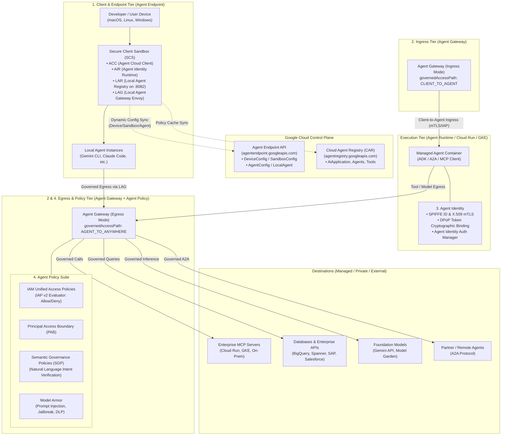
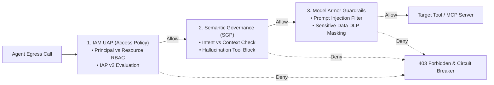
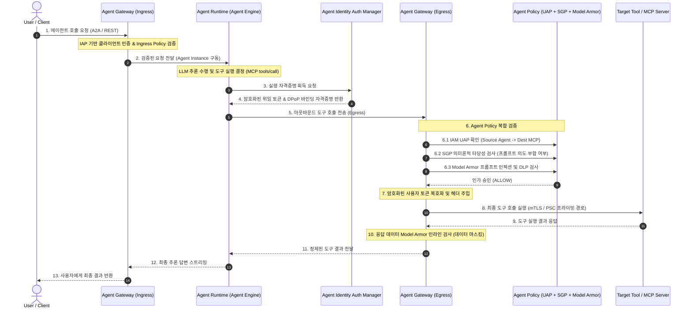

# Gemini Enterprise Agent Engine: 심층 아키텍처 개요 (Level 300/400)

## 1. 개요 및 플랫폼 진화 (Evolution & "Shift Down" Architecture)

과거 **Vertex AI Agent Engine**(또는 Reasoning Engine)으로 불리던 에이전틱 런타임은 엔터프라이즈 전반의 구축(Build), 확장(Scale), 거버넌스(Govern), 최적화(Optimize)를 포괄하는 **Gemini Enterprise Agent Platform (GEAP)** 생태계로 전면 통합 및 고도화되었습니다.

엔터프라이즈 환경에서 자율적 추론(Reasoning), 도구 실행(Tool Execution), 멀티 에이전트 오케스트레이션(A2A)이 본격화됨에 따라 기존의 정적 제로 트러스트(Zero Trust) 모델만으로는 프롬프트 인젝션, 환각 기반 도구 오용, 토큰 탈취, 데이터 유출(Exfiltration)을 방어하기 어렵습니다.

Google Cloud는 이를 해결하기 위해 **"Shift Down" 엔지니어링 철학**을 적용했습니다. 개발자 개개인이 복잡한 상호 인증(mTLS), 토큰 서명, 암호화, 정책 인가를 직접 구현하지 않고, **네트워크 인프라 및 플랫폼 레이어(Agent Gateway, Agent Identity, Agent Policy, Agent Endpoint)**가 이를 자동으로 집행하도록 구조화했습니다.

---

## 2. 핵심 4대 컴포넌트 아키텍처 토폴로지



---

## 3. 컴포넌트별 기술 심층 분석

### 3.1. Agent Endpoint (클라이언트 샌드박스 및 호출 엔드포인트 거버넌스)

Agent Endpoint는 클라우드 중심의 거버넌스를 개발자 워크스테이션 및 엔드포인트 디바이스까지 확장하는 **Secure Client Sandbox (SCS)**의 제어 플레인과, 에이전트 상호작용의 타깃이 되는 **서비스 엔드포인트**라는 두 가지 핵심 축으로 구성됩니다.

#### A. Agent Endpoint API (`agentendpoint.googleapis.com`)
로컬 머신(macOS, Linux, Windows)에서 실행되는 AI 에이전트(예: Gemini CLI, Claude Code, 엔터프라이즈 코딩 에이전트)를 중앙에서 격리 및 정책 통제하기 위한 Google Cloud One Platform 공식 API입니다.

* **계층형 리소스 계층 구조 (Resource Hierarchy)**:
  1. `DeviceConfig`:
     - 리소스 경로: `projects/{proj}/locations/{loc}/deviceConfigs/{deviceConfigId}`
     - 디바이스 플릿 단위 정책. Workload Identity Pool Provider 바인딩 및 Enterprise Certificate Proxy(macOS Keychain, Linux PKCS#11, Windows CryptoAPI) 정의.
  2. `SandboxConfig`:
     - 리소스 경로: `projects/{proj}/locations/{loc}/sandboxConfigs/{sandboxConfigId}`
     - 에이전트가 격리될 샌드박스 환경 사양. OS 격리 프로파일(macOS Seatbelt, Linux Bubblewrap, MicroVM), 프록시 엔드포인트 설정, 연결된 Agent Registry의 `AiApplication` 매핑.
  3. `AgentConfig`:
     - 리소스 경로: `.../sandboxConfigs/{sandboxConfigId}/agentConfigs/{agentConfigId}`
     - 특정 바이너리/명령어(예: `claude-code`, `jetski-cli`)에 대한 실행 파라미터 및 바이너리 해시 검증 스펙.
  4. `LocalAgent`:
     - 리소스 경로: `.../agentConfigs/{agentConfigId}/localAgents/{localAgentId}`
     - 디바이스에서 실제 구동된 런타임 인스턴스. 사용자의 CPI(Cloud Principal Identifier)와 바인딩되며, 생성 시 Agent Registry에 정식 Agent URN으로 자동 등록.

#### B. 온-디바이스(On-Device) 런타임 아키텍처
* **ACC (Agent Cloud Client)**: 로컬 프로세스 수명주기(Lifecycle: Start, Bootstrap, AddSandbox, Stop) 관리.
* **AIR (Agent Identity Runtime)**: 에이전트의 프로세스 권한을 확인하고 로컬 자격증명을 중계.
* **LAR (Local Agent Registry - `lard`)**:
  - 루프백 포트 `127.0.0.1:8082`에서 gRPC로 동작하는 초경량 정책 데몬.
  - Cloud Agent Registry(CAR)의 인가 목록(Agents, MCP Servers, Endpoints)을 SQLite(`~/.scs/lar/lar.db`)에 로컬 동기화.
  - **Fail-Static 운영성**: 네트워크가 단절된 오프라인(비행기, 폐쇄망) 상태에서도 기 캐시된 정책에 대해 무중단 정상 평가 지원. 미캐시된 신규 타깃에 대해서는 엄격한 **Fail-Closed(403 차단)** 집행.
* **LAG (Local Agent Gateway)**: 로컬 Envoy 기반 포워드 프록시로, 에이전트 프로세스의 모든 아웃바운드 트래픽을 가로채 LAR 및 클라우드 PDP(Prism)로 검증.

---

### 3.2. Agent Gateway (에이전틱 트래픽 네트워크 관제탑)

**Agent Gateway**(`networkservices.googleapis.com/agentGateways`)는 에이전트 생태계의 모든 통신을 중앙에서 중계, 검사, 인가하는 **Layer 7 지능형 네트워킹 게이트웨이**입니다.

#### A. 두 가지 주요 트래픽 경로 (Governed Access Paths)
1. **Client-to-Agent (Ingress Mode)**:
   - 설정 플래그: `governedAccessPath = CLIENT_TO_AGENT`
   - 외부 클라이언트(개발자 IDE, Web 클라이언트, 파트너 시스템)에서 Google Cloud 내부의 Agent Runtime, Cloud Run, GKE로 유입되는 트래픽 제어.
   - mTLS 및 DPoP 종료, Identity-Aware Proxy(IAP) 기반 인증, 조직 수준 Ingress IAM 검증.
2. **Agent-to-Anywhere (Egress Mode)**:
   - 설정 플래그: `governedAccessPath = AGENT_TO_ANYWHERE`
   - 에이전트가 외부 도구(MCP 서버), 사내 데이터베이스, 타 에이전트, 서드파티 SaaS API를 호출할 때 경유.
   - 아웃바운드 mTLS 핸드셰이크 자동화, MCP(JSON-RPC) 및 A2A 메시지 인터셉션, 자격증명 복호화 주입, 데이터 유출 방지(DLP) 인라인 검사.

#### B. Level 400 엔터프라이즈 네트워킹 & 인프라 패턴
* **프로토콜 네이티브 인터셉션**:
  - 단순 HTTP 전달이 아닌, **Model Context Protocol (MCP)** 및 **Agent-to-Agent (A2A)** 프로토콜을 L7 레벨에서 파싱하여 도구 호출 파라미터(`tools/call`) 및 에이전트 스킬 요청을 심층 분석.
* **VPC Service Controls (VPC-SC) 및 PSC Interface 연동**:
  - Agent Gateway는 Network Attachment(`compute.networkAttachments`)를 통해 고객 프라이빗 VPC 내 Private Service Connect(PSC) 인터페이스와 직결됩니다.
  - 이를 통해 관리형 Agent Runtime 컨테이너의 아웃바운드 트래픽 전체를 고객사 VPC-SC 보안 경계 내로 강제 라우팅(Egress All via VPC)합니다.
* **Service Extensions (Envoy `ext_proc`) 기반 에코시스템 확장**:
  - gRPC 기반 `ext_proc`을 통해 Palo Alto Networks, Cisco, Check Point, CrowdStrike 등 서드파티 보안 엔진과 실시간 인라인 트래픽 검사 체인을 구성할 수 있습니다.
* **운영 모드 (Enforcement Modes)**:
  - `DRY_RUN`: 프로덕션 적용 전 정책 위반 트래픽을 차단하지 않고 Cloud Audit Logs에만 기록하여 영향도 사전 검증.
  - `ENFORCE`: 정책 위반 즉시 HTTP 403 Forbidden 및 세션 차단 집행.

---

### 3.3. Agent Identity (암호학적 고유 식별 및 자격증명 관리)

전통적인 클라우드 아키텍처에서는 워크로드에 광범위한 서비스 계정(Service Account)을 부여했으나, 이는 다중 에이전트 환경에서 횡적 이동(Lateral Movement) 및 권한 남용의 취약점이 됩니다. Agent Identity는 에이전트 단위의 영구적이고 위조 불가능한 암호학적 페르소나를 부여합니다.

#### A. SPIFFE 표준 및 암호학적 토큰 바인딩
* **SPIFFE ID 기반 워크로드 식별**:
  - 각 에이전트는 SPIFFE 표준 기반의 고유한 X.509 인증서(SVID)를 런타임에 직접 발급받습니다.
  - 서비스 계정 키 파일과 같은 영구 정적 시크릿 생성을 원천 차단합니다.
* **DPoP (Demonstrating Proof-of-Possession) & mTLS**:
  - 에이전트가 Google Cloud API 또는 외부 리소스에 접근할 때 발급받는 OAuth 액세스 토큰은 에이전트 고유의 개인키에 암호학적으로 바인딩(DPoP)됩니다.
  - 메모리 덤프나 로그 노출을 통해 토큰이 탈취되더라도, 해당 개인키를 소유하지 않은 타 인스턴스에서는 토큰을 사용할 수 없습니다.
* **Principal Access Boundary (PAB)**:
  - Agent Identity에 PAB 정책을 적용하여, 해당 에이전트가 호출할 수 있는 조직 내 리소스의 물리적 바운더리를 제한합니다.

#### B. Dual Authority 모델 및 Auth Manager
Agent Identity는 두 가지 권한 부여 모델을 명확히 분리합니다:

| 구분 | Authority 모델 | 인증 메커니즘 | 주 사용처 |
| :--- | :--- | :--- | :--- |
| **Agent 고유 권한** | Agent's Own Authority | SPIFFE mTLS / DPoP | 시스템 인프라 접근, 내부 지식 검색(Vector Search), 플랫폼 관리 API 호출 |
| **사용자 위임 권한** | User-Delegated Authority | 3-legged OAuth 2.0 | 사용자를 대신하여 Jira, GitHub, Slack, Google Drive/Calendar 등의 데이터 조회/수정 |

* **자격증명 제로 노출(Zero-Exposure Credential Architecture)**:
  - 사용자의 3-legged OAuth 토큰은 **Agent Identity Auth Manager**에 의해 강력하게 암호화되어 관리됩니다.
  - 에이전트 코드 및 LLM 런타임 메모리에는 원시 토큰(Raw Token)이 노출되지 않으며, 오직 **Agent Gateway**를 통과하는 시점에 게이트웨이 인프라가 토큰을 안전하게 주입(Decryption & Injection)합니다. 에이전트가 탈옥(Jailbreak)되더라도 사용자 자격증명 유출이 불가능합니다.

---

### 3.4. Agent Policy (다차원 정책 거버넌스 프레임워크)

Agent Policy는 단순한 인프라 방화벽을 넘어 **네트워크-인증-의미론-콘텐츠**를 관통하는 심층 방어(Defense-in-Depth) 정책 체계입니다.



#### A. IAM Unified Access Policies (UAP) / Access Policies
* **역할**: 에이전트 주체(`Agent Principal`)와 대상 리소스(`Destination Resource`: 대상 Agent, MCP 서버, 외부 Endpoint) 간의 접근을 통제하는 L7 인가 정책.
* **집행 주체**: Agent Gateway 내부의 IAP(Identity-Aware Proxy) v2 엔진.
* **정책 규칙 구조**:
  - `Allow Rules`: 특정 Agent Identity가 지정된 MCP 도구 또는 엔드포인트 URL 패턴으로 통신하는 것을 명시적 허용.
  - `Deny Rules`: 위험성이 높은 도구 호출이나 미승인 엔드포인트 접근을 우선 차단.

#### B. Semantic Governance Policies (SGP - 의미론적 거버넌스)
* **역할**: 자연어 및 컨텍스트 레벨에서 에이전트의 도구 호출 의도를 검증하는 혁신적 거버넌스 계층.
* **작동 원리**:
  - 에이전트가 도구 호출(`tools/call`)을 시도할 때, 사용자의 최초 입력 프롬프트, 대화 히스토리, 도구 매개변수의 의미적 타당성을 검사.
  - 예: "고객 문의 요약"을 요청받은 에이전트가 환각(Hallucination)으로 인해 사내 "결제 취소 API"를 호출하려는 경우, IAM 권한이 있더라도 **Semantic Policy 위반으로 즉각 차단**.

#### C. Model Armor (AI 보안 및 콘텐츠 가드레일)
* **역할**: 대규모 언어 모델 상호작용 및 도구 응답 데이터에 대한 인라인 보안 필터링.
* **핵심 방어 영역**:
  1. **Prompt Injection & Jailbreak 방어**: 사용자 입력 또는 서드파티 MCP 도구의 리턴 데이터에 숨겨진 프롬프트 탈옥 공격 탐지.
  2. **DLP & 데이터 유출 방지**: 주민번호, 신용카드, API 키 등 민감 데이터(PII/Secrets)가 도구 호출 파라미터나 모델 응답에 포함될 경우 실시간 마스킹 또는 차단.
  3. **Circuit Breaker (비상 차단기)**: 이상 징후 발생 시 에이전트 인스턴스의 실행을 강제 중단하여 통제 불능(Rogue Agent) 상태 방지.

---

## 4. End-to-End 인터랙션 라이프사이클

전체 시스템이 실제 요청을 처리할 때 4대 컴포넌트가 결합되는 엔드투엔드 흐름입니다:



---

## 5. 엔터프라이즈 운영 및 배포 가이드 (Practice CE 실무 관점)

### 5.1. Terraform 구성 예시 (Agent Gateway)

```hcl
# Google Beta Provider 활성화 필요
resource "google_network_services_agent_gateway" "enterprise_egress_gateway" {
  provider             = google-beta
  project              = var.project_id
  location             = var.region
  name                 = "prod-agent-egress-gateway"
  governed_access_path = "AGENT_TO_ANYWHERE"
  
  # VPC-SC 경계 라우팅을 위한 PSC Network Attachment 바인딩
  network_attachment   = google_compute_network_attachment.agent_vpc_attachment.id
  
  # 검증 모드: 초기 배포 시 DRY_RUN, 검증 완료 후 ENFORCE 전환
  enforcement_mode     = "ENFORCE"

  labels = {
    environment = "production"
    managed_by  = "terraform"
  }
}
```

### 5.2. ADK 배포 연동 CLI (`agents-cli`)

ADK(Agent Development Kit)로 개발된 에이전트를 배포할 때, Agent Identity를 활성화하고 Agent Gateway와 단일 명령으로 바인딩합니다:

```bash
# Agent Identity 활성화 및 Ingress/Egress Gateway 바인딩 배포
agents-cli deploy \
  --project="my-enterprise-project" \
  --region="us-central1" \
  --deployment-target="agent_runtime" \
  --agent-identity \
  --agent-gateway-ingress="projects/my-enterprise-project/locations/us-central1/agentGateways/prod-agent-ingress-gateway" \
  --agent-gateway-egress="projects/my-enterprise-project/locations/us-central1/agentGateways/prod-agent-egress-gateway" \
  --service-account="prod-agent-sa@my-enterprise-project.iam.gserviceaccount.com" \
  --cpu=2 \
  --memory=8Gi \
  --concurrency=16 \
  --min-instances=1 \
  --max-instances=20
```

---

## 6. 요약 매트릭스

| 컴포넌트 | 핵심 기능 | 담당 계층 | 주요 보안/거버넌스 메커니즘 |
| :--- | :--- | :--- | :--- |
| **Agent Endpoint** | • 클라이언트 디바이스 에이전트 격리 (SCS)<br/>• 서비스 호출 엔드포인트 관리 | Endpoint / Client & Dest | • `DeviceConfig`/`SandboxConfig`/`LocalAgent` 계층<br/>• LAR SQLite 로컬 캐시 (Fail-Static/Fail-Closed) |
| **Agent Gateway** | • 인바운드/아웃바운드 트래픽 제어<br/>• L7 에이전틱 프로토콜 중계 | Network L7 (Envoy) | • Client-to-Agent / Agent-to-Anywhere<br/>• mTLS, PSC Network Attachment, VPC-SC 강제 라우팅 |
| **Agent Identity** | • 워크로드 암호학적 신원 부여<br/>• 사용자 자격증명 격리 관리 | Identity & Auth | • SPIFFE X.509 SVID & DPoP 토큰 바인딩<br/>• Auth Manager 제로 노출(Zero-Exposure) 토큰 주입 |
| **Agent Policy** | • 도구 호출 및 통신 인가<br/>• AI 위험 방어 및 의도 검증 | Policy & Security | • IAM UAP (Allow/Deny via IAP v2)<br/>• Semantic Governance (SGP)<br/>• Model Armor (Prompt Injection, DLP) |
